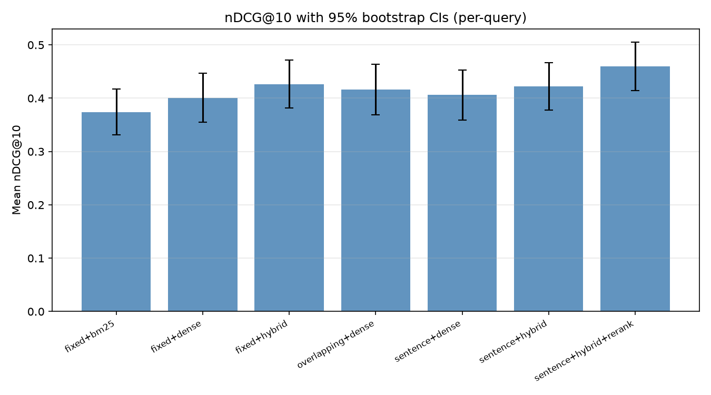
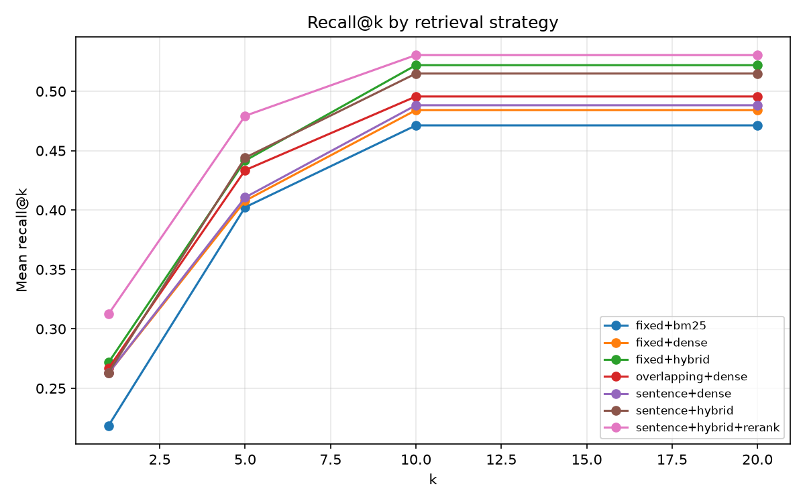
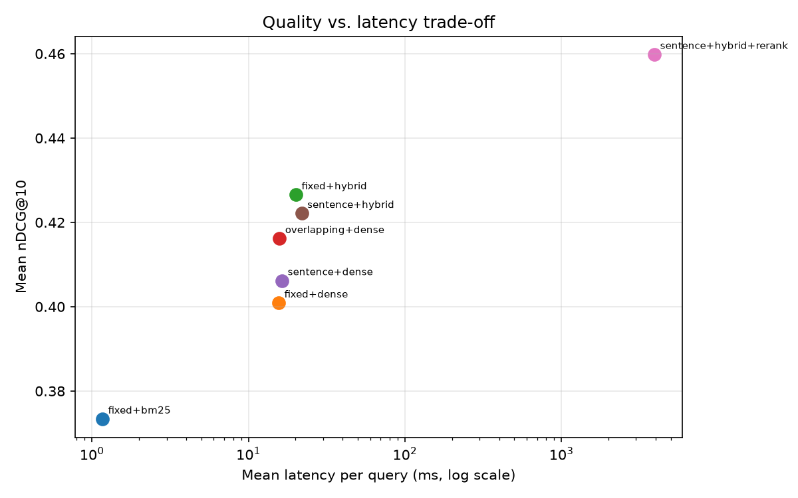

# RAG Evaluation Lab

**The differentiator in production RAG is evaluation, not the demo.** This lab
compares chunking strategies × retrieval methods × reranking on a real
49-article Wikipedia corpus (ML/statistics topics, 268k words), with
recall@k / MRR / nDCG@k, paired bootstrap confidence intervals, latency
measurements, and a faithfulness-proxy support score — instead of vibes.

> **Scope honesty:** no LLM API keys were available, so everything runs locally
> on CPU. This lab therefore covers the *retrieval + evaluation* half of RAG
> (chunking, embeddings, hybrid retrieval, reranking, rigorous evaluation) —
> which is exactly where production RAG systems are won or lost. There is no
> answer-generation step; the README documents this as a deliberate scope
> choice, not a gap.

## Problem statement

A team wants to ground an LLM assistant in a corpus of technical documents.
Before any generation happens, they need answers to:

1. Which chunking strategy retrieves the right passages most reliably?
2. Does hybrid (BM25 + dense, fused with RRF) beat either alone?
3. Does cross-encoder reranking help, and what does it cost in latency?
4. Are the differences *statistically significant* or noise?

## Methodology

- **Corpus:** 49 English Wikipedia articles (ML/statistics/probability),
  1,173 sections, 268,127 words, fetched 2026-10-06 via the MediaWiki API.
  See `data/README.md`.
- **Chunking (3 strategies):** fixed-size (200 words), overlapping (200/50),
  sentence-aware (≤200 words, never splits sentences).
- **Retrieval (3 methods):** BM25 (`rank-bm25`), dense (all-MiniLM-L6-v2 +
  FAISS `IndexFlatIP` on normalized embeddings = cosine), hybrid via
  **reciprocal rank fusion** (k=60) over top-100 of each.
- **Rerank:** cross-encoder `ms-marco-MiniLM-L-6-v2` over top-20 → top-10.
- **Eval set (synthetic, honestly described):** 2,054 queries derived from
  corpus structure — for each section (≥40 words), one keyword-style query
  (the heading) and one templated question; relevance = chunks from that
  section. This is BEIR-style structure-derived evaluation: it measures
  "can the retriever find the passage a query refers to". It is NOT
  human-labeled QA. Known limits: synthetic queries correlate with section
  vocabulary; binary section-level relevance; one information need per query.
- **Metrics:** recall@k, MRR@k, nDCG@k (k = 1, 5, 10, 20); paired bootstrap
  95% CIs (10,000 resamples over queries) for strategy differences; per-query
  latency (mean, p95); support score = max cross-encoder relevance over the
  top-3 sentences of the top chunk (a *weak proxy* for faithfulness — relevance
  ≠ entailment; a proper MNLI check is future work).
- **Evaluation sample:** strided subsample of 300 queries (evenly spread over
  documents and query types) for sane CPU runtime; documented in
  `results/metrics.json`.

## Results

300-query strided eval (49 Wikipedia docs, 1,983–2,150 chunks depending on
strategy). Full numeric record in [`results/metrics.json`](results/metrics.json);
figures in [`results/figures/`](results/figures/).

| Strategy | nDCG@10 | MRR@10 | Recall@10 | Mean latency/query |
|---|---|---|---|---|
| fixed + BM25 | 0.373 | 0.393 | 0.471 | 1.2 ms |
| fixed + dense | 0.401 | 0.421 | 0.484 | 15.6 ms |
| fixed + hybrid (RRF) | 0.427 | 0.450 | 0.522 | 20.1 ms |
| overlapping + dense | 0.416 | 0.430 | 0.496 | 15.8 ms |
| sentence + dense | 0.406 | 0.430 | 0.488 | 16.4 ms |
| sentence + hybrid (RRF) | 0.422 | 0.444 | 0.515 | 21.9 ms |
| **sentence + hybrid + cross-encoder rerank** | **0.460** | **0.502** | **0.530** | 3,937 ms |

**Paired bootstrap 95% CIs for nDCG@10 difference (best vs. rest, 10,000 resamples):**

| Comparison | Δ nDCG@10 | 95% CI | p |
|---|---|---|---|
| rerank vs fixed+hybrid | +0.033 | [+0.011, +0.056] | 0.002 |
| rerank vs sentence+hybrid | +0.038 | [+0.016, +0.061] | 0.001 |
| rerank vs overlapping+dense | +0.044 | [+0.014, +0.075] | 0.005 |
| rerank vs sentence+dense | +0.054 | [+0.025, +0.083] | <0.001 |
| rerank vs fixed+dense | +0.059 | [+0.030, +0.089] | <0.001 |
| rerank vs fixed+BM25 | +0.087 | [+0.060, +0.113] | <0.001 |

**What the numbers say:**

1. **Reranking wins, and it's significant.** The cross-encoder rerank is the
   only change that beats every other strategy with all CIs excluding zero.
   The cost is real: ~3.9 s/query on CPU (vs ~22 ms for hybrid) — the classic
   quality/latency trade-off, measured rather than asserted.
2. **Hybrid beats either signal alone.** RRF fusion (0.427) outperforms pure
   dense (0.401) and pure BM25 (0.373) on the same chunks — lexical and
   semantic signals are complementary on this corpus.
3. **Chunking matters less than retrieval.** The three dense-only configs sit
   within 0.401–0.416; the retrieval method moves the needle more than the
   segmentation. (On a noisier corpus with messier boundaries, expect chunking
   to matter more — stated as a limit, not a law.)
4. **BM25 is 15× faster and not embarrassing.** At 1.2 ms/query it reaches
   0.373 nDCG@10 — a legitimate production choice when latency dominates.
5. **Support scores track retrieval quality** (rerank config highest at 4.33),
   consistent with "the top chunk actually addresses the query" — but remember
   this is a relevance proxy, not entailment.





## Quick start (≤3 commands)

```bash
python -m venv .venv && source .venv/bin/activate
pip install -r requirements.txt
PYTHONPATH=src python scripts/run_analysis.py
```

The corpus is fetched once with `PYTHONPATH=src python -m raglab.corpus`
(cached in `data/`, git-ignored). Model weights download from Hugging Face
on first use (~200 MB total).

## Project structure

```
src/raglab/
  corpus.py        # Wikipedia fetch + section parsing (curl-based, resumable)
  chunking.py      # fixed / overlapping / sentence-aware chunkers
  retrieval.py     # BM25, dense (FAISS), hybrid (RRF) — common interface
  rerank.py        # cross-encoder reranking + batched pair scoring
  evalset.py       # structure-derived synthetic eval queries
  evaluation.py    # recall/MRR/nDCG, paired bootstrap CIs, support scoring
  visualization.py # recall curves, CI bars, latency trade-off, win/loss
scripts/run_analysis.py  # the full bake-off
tests/             # pytest: chunking invariants, metric hand-checks,
                   # RRF correctness, eval-set integrity, determinism
docs/math_notes.md # cosine geometry, BM25, RRF, nDCG/MRR, bootstrap, faithfulness
data/README.md     # corpus provenance
results/           # metrics.json + figures (committed)
```

## Reproducibility

- Pinned dependencies (`requirements.txt`); Python 3.12.
- Bootstrap seed 42; strided (deterministic) query subsampling.
- CPU deterministic: FAISS exact search, fixed model weights.

## Limitations & future work

1. **No generation step** (no LLM API keys): the lab evaluates retrieval, not
   end-to-end answer quality. The support score is a relevance proxy, not NLI.
2. **Synthetic eval set**: structure-derived queries are a proxy for real user
   questions; absolute scores shouldn't be compared across corpora.
3. **Single domain** (ML/statistics Wikipedia): BM25-friendly vocabulary may
   flatter lexical methods; a multi-domain corpus would be a stronger test.
4. **Small models**: all-MiniLM-L6-v2 / ms-marco-MiniLM-L-6-v2 trade accuracy
   for CPU feasibility; larger encoders would shift the dense-vs-hybrid balance.
5. Future: proper MNLI-based faithfulness, graded relevance judgments,
   query-expansion (HyDE) comparison, ANN index (HNSW) recall/latency study.

## References

- Cormack, Clarke & Buettcher (2009) — Reciprocal Rank Fusion.
- Robertson & Zaragoza (2009) — The Probabilistic Relevance Framework: BM25.
- Karpukhin et al. (2020) — Dense Passage Retrieval.
- Reimers & Gurevych (2019) — Sentence-BERT.
- BEIR benchmark (Thakur et al., 2021) — structure-derived retrieval evaluation.
